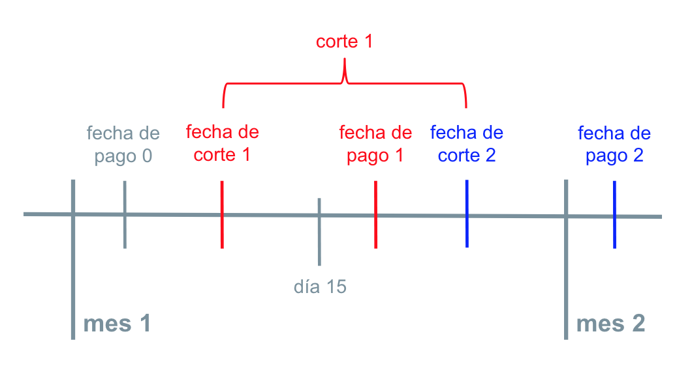
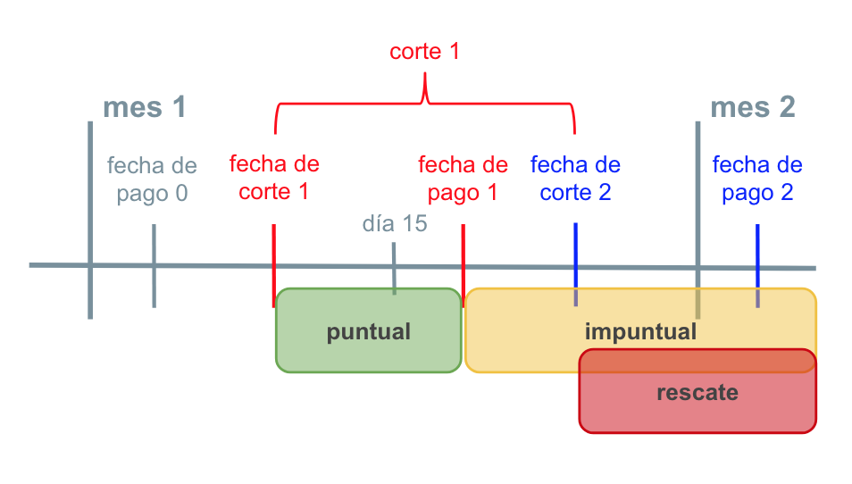

<!-- # Introduction {#intro} -->

<!-- You can label chapter and section titles using `{#label}` after them, e.g., we can reference Chapter \@ref(intro). If you do not manually label them, there will be automatic labels anyway, e.g., Chapter \@ref(methods). -->

<!-- Figures and tables with captions will be placed in `figure` and `table` environments, respectively. -->

<!-- ```{r nice-fig, fig.cap='Here is a nice figure!', out.width='80%', fig.asp=.75, fig.align='center'} -->
<!-- par(mar = c(4, 4, .1, .1)) -->
<!-- plot(pressure, type = 'b', pch = 19) -->
<!-- ``` -->

<!-- Reference a figure by its code chunk label with the `fig:` prefix, e.g., see Figure \@ref(fig:nice-fig). Similarly, you can reference tables generated from `knitr::kable()`, e.g., see Table \@ref(tab:nice-tab). -->

<!-- ```{r nice-tab, tidy=FALSE} -->
<!-- knitr::kable( -->
<!--   head(iris, 20), caption = 'Here is a nice table!', -->
<!--   booktabs = TRUE -->
<!-- ) -->
<!-- ``` -->

<!-- You can write citations, too. For example, we are using the **bookdown** package [@R-bookdown] in this sample book, which was built on top of R Markdown and **knitr** [@xie2015]. -->

# Contexto 

## La organización

La organización en estudio es una SOFOM (Sociedad Financiera de Objeto Múltiple) que realiza otorgamiento de crédito. En México las SOFOMes son una buena opción para aquellos sectores de la población con acceso a financiamiento limitado. Esto es porque la forma en que ofrecen créditos generalmente es más simple, flexible y con menores requisitos que la de las grandes Instituciones financieras. Cabe mencionar que el costo de esta accesibilidad es una tasa de interés más alta. 

En este trabajo no revelaremos la razón social de la SOFOM en estudio y de aquí en adelante nos referiremos a esta como el *Banco*. Tampoco se presentarán los datos globales del Banco: como el tamaño de su cartera de crédito o su número de acreditados. Sin embargo, los fines de este trabajo requieren que se describan las características de los créditos que otorga el Banco y en particular nos interesa explicar la forma en que este clasifica el comportamiento de pago de sus clientes.

Aunque el Banco no otorga créditos de forma directa en sucursal; tampoco se trata de un negocio de e-lending. La forma en que el Banco presta es a través de comisionistas. No nos concentraremos en explicar la relación entre los comisionistas y el Banco ya que, para nuestros fines, la podemos entender simplemente como la relación de un acreedor con un deudor en un contrato de crédito. Por esto, nos referimos a los comisionistas como *clientes* o *acreditados*.

Los créditos que el Banco otorga a sus clientes son de tipo *revolvente*. A diferencia de los créditos tradicionales en los que se presta un valor inicial y se acuerda un plazo y pagos fijos para saldar la deuda, los créditos revolventes cuentan con un límite y los clientes pueden disponer del crédito cuando lo requieren.

El Banco guarda la información transaccional de sus clientes y, de acuerdo a una evaluación hecha por un equipo de científicos de datos, cuenta con una **madurez de datos** suficiente para incorporar pipelines de aprendizaje de máquina a sus procesos. 

## Problema a Resolver

El Banco buscó a un equipo de científicos de datos para trabajar en un proyecto que consistiría en la creación de *indicadores de riesgo* de sus clientes. A continuación explicaremos la motivación detrás de la creación de dichos indicadores. Por confidencialidad, no se dan a conocer valores específicos del negocio. 

Previo a iniciar el proyecto, el Banco asegura haber observado una tendencia ascendente en el quebranto de su cartera. Esto significa que hubo un aumento en el número de clientes que dejaban definitivamente de pagar. Por una parte dicho aumento se podía explicar por el crecimiento en la cartera; sin embargo, una idea prevalente en el Banco es que cambios en su estrategia aceleraron la tendencia.

Para conocer los cambios de estrategia que hizo el Banco, primero hay que entender el calendario de pagos que utiliza. Como en cualquier crédito revolvente, cada inicio de *corte* se determina el *monto a pagar* de cada cliente y la *fecha de pago* es la fecha límite en la que los clientes deben cubrir el monto que les corresponde. Un pago lo entendemos como un par de datos dado por (fecha de corte, monto a pagar).

Las fechas de corte de los créditos del Banco son quincenales y regularmente caen el 8 de cada mes para pagar el 18, y el 23 para pagar el 3 del siguiente mes. Así el calendario de fechas de corte y pago lo podemos representar en una línea de tiempo como en la figura \@ref(fig:calendario).

```{r, calendario, fig.cap="Representación de fechas de corte y fechas de pago", echo=FALSE, out.width="70%", fig.align="center"}

```

La *cobranza preventiva* se refiere a aquellas acciones que se realizan antes de la fecha límite de pago para recordar a los acreditados que realicen sus pagos. La *cobranza correctiva* son las acciones que se disparan después de la fecha de pago para dar seguimiento a los clientes que no cubrieron su monto correspondiente. Créditos con 90 días vencidos pasan a quebranto.

De acuerdo con el Banco, anteriormente se decidió disminuir los recursos destinados a la cobranza preventiva. Esa estrategia provocó que eventualmente tuvieran que aumentarse los recursos destinados a la cobranza correctiva y que ultimadamente aumentara el quebranto más de lo esperado. 

La motivación detrás del proyecto es fortalecer la cobranza preventiva identificando los posibles evento de impago. Además, generar indicadores de riesgo permite crear controles para evitar que clientes en problemas intenten financiar su deuda con más deuda.

## Solución Propuesta

Los clientes pueden cubrir su monto a pagar en una sola exhibición o en varios abonos. La fecha en la que los abonos o movimientos cubren el monto a pagar la llamaremos *fecha de abono*. Dependiendo del momento en que ocurre la fecha de abono el Banco clasifica los pagos en tres:

* **Pago puntual** si la fecha de abono ocurre antes de la fecha de pago.
* **Pago impuntual** si la fecha de abono se encuentra después de la fecha de pago.
* **Pago en rescate** si no se cubrió el monto a pagar antes de la fecha de corte del siguiente período.

En la figura \@ref(fig:clasificacion) se esquematiza la clasificación de pagos en una línea de tiempo.

```{r, clasificacion, echo=FALSE, out.width="70%", fig.align="center", fig.cap="Clasificación de pagos"}

```

El equipo de científicos de datos propuso construir un producto de datos que generara dos indicadores de riesgo. El primero, que llamamos el **indicador de impuntualidad** mide, la probabilidad de que un cliente haga pagos impuntuales en los siguientes tres períodos o cortes. El segundo, el **monto en riesgo**, es el indicador de impuntualidad ponderado por el saldo actual del cliente. Al ponderar por saldo, el monto en riesgo permite priorizar a los clientes impuntuales que representan un mayor riesgo para el negocio.

Considerando datos históricos, cálculamos el número de días que se aleja la fecha de abono de la fecha de pago. A esta diferencia la llamamos el *momento de pago*. Así los momentos de pago menores o iguales a cero representan pagos puntuales y los mayores a cero pagos impuntuales. En la figura \@ref(fig:triangulo) tenemos la distribución de los momentos de pago acotados entre -7 y 20.  El Banco se refiere a esta distribución como el *triángulo de pagos*. Como vemos los clientes prefieren pagar un día antes de la fecha de pago, es decir la moda del momento de pago es -1.

```{r, triangulo, fig.cap="Triángulo", echo=FALSE, fig.cap="Triángulo de pagos", fig.align="center"}
creditos %>% 
  mutate(triangulo = if_else(dias_despues_fechaPago_prom_decay > 20, 20, dias_despues_fechaPago_prom_decay), 
         triangulo = if_else(triangulo < -7, -7, triangulo), 
         triangulo = floor(triangulo)) %>% 
  group_by(triangulo) %>% 
  summarize(count = n()) %>% 
  ungroup() %>% 
  mutate(color_triangulo = "impuntual", 
         color_triangulo = if_else(triangulo <= 0, "puntual", color_triangulo), 
         color_triangulo = if_else(triangulo > 5, "rescate", color_triangulo)) %>% 
  ggplot(aes(x=triangulo, y=count, fill = color_triangulo)) + 
  geom_col() + 
  scale_fill_manual(values = c("puntual" = "#6aa84f7d", 
                               "impuntual" = "#f1c2327d", 
                               "rescate" = "#cc000080")) + 
  labs(y = "Conteo", x = "Momento de pago", fill = "Tipo de pago") + 
  theme(axis.text.y = element_blank())
  
```

De acuerdo con los científicos de datos, el indicador de impuntualidad debía ser el encargado de predecir si, en los siguientes tres cortes, el momento de pago de un cliente caerá en la cola amarilla y roja del tríangulo de pagos. El Banco aceptó la propuesta.

## Mecanismo de Validación

El indicador de impuntualidad requiere un modelo supervisado de clasificación; los modelos supervisados requieren datos etiquetados. Como el Banco considera que es común que los clientes se atrasen uno o dos días sin representar un riesgo, se decidió que la etiqueta debía considerar el promedio de los momentos de pago de los siguientes tres cortes. La etiqueta es 1 si el promedio es mayor a 2 y la etiqueta es 0 en los demás casos. 

Se obtuvieron etiquetas para cada cliente y para cada corte en los datos históricos del Banco. Con esto, tenemos que el 87.85% son casos negativos y el 12.15% casos positivos.

Para nuestro problema de clasificación es posible utilizar cualquiera de los siguientes modelos base: la **regla cero** (zero rule, 0R or ZeroR) o el **muestreo aleatorio**. La regla cero consiste en asignar una predicción "cero" en todos los casos.

Calculando las métricas de desempeño teóricas para la regla cero tenemos un *accuracy* de 87.85%, un *recall* de 0% y una *especificidad* de 100%. La *matriz de confusión* (condicionada al actual) correspondiente es: 

|                |          | **actual**            |
|----------------|----------|-----------|-----------|
|                |          |  positivo |  negativo |
| **predicción** | positivo |     0     |    0      |
|                | negativo | 100%      | 100%      |

Para las métricas de desempeño teóricas del muestreo aleatorio tenemos un accuracy de 78.65% (0.8785 \* 0.8785 + 0.1215 \* 0.1215), un recall de 12.15%, una especificidad de 87.85% y la siguiente matriz de confusión (condicionada al actual): 

|                |          | **actual**                 |
|----------------|----------|--------------|-------------|
|                |          |   positivo   |  negativo   |
| **predicción** | positivo |  12.15%      |   12.15%    |
|                | negativo |  87.85%      |   87.85%    |

Al contar con estos valores de referencia se estableció que para ponerse en producción el indicador de impuntualidad, este debía alcanzar al menos un nivel de recall de 50% y de especificidad de 90%. El accuracy correspondiente a estos valores de recall y especificidad es de 85% (0.8785 \* 0.9 + 0.1215 \* 0.5).

## Plan de Trabajo

El entregable del proyecto consiste en un pipeline de datos que permite actualizar cada quincena los últimos movimientos de los clientes y producir los indicadores o predicciones correspondientes. Con esto en mente, el plan de trabajo que los científicos de datos siguieron fue: 

1. **EDA** se dio sentido a los datos transaccionales para que reflejaran las historias de crédito de los clientes. Para esto, se trabajó con los dueños de los datos del Banco. La limpieza de datos fue extensiva y se incorporó al pipeline una tarea que identifica, limpia y lista errores cada vez que se actualizan los datos.
2. **Feature engineering** se transformaron todas las variables explicativas para que capturaran el comportamiento pasado de los acreditados usando *promedios móviles con decaimiento exponencial*.
3. **Model selection** se probaron distintos modelos de clasificación y se determinaron los mejores hiperparámetros, entre ellos el *halflife* del decaimiento exponencial.
4. **Code refactoring** se factorizó el código y se crearon contenedores para cada una de las tareas del pipeline.

Además, se trabajó con ingenieros de datos que estuvieron encargados del **ETL** y del **pipeline testing**. Para el ETL se desarrollaron los procesos de extracción de datos que alimentan al resto de las tareas. Durante el pipeline testing se validaron los resultados que produce el pipeline y se probó con el Banco el funcionamiento de la entrega.

En el siguiente capítulo describiremos las etapas 1 a 4 de este plan de trabajo. Cabe mencionar que el plan de trabajo de este proyecto también contempla etapas que no se cubren en este documento. En esas etapas se dió seguimiento al efecto de las acciones de cobranza preventiva que el Banco implementó a partir de los indicadores de riesgo que se desarrollaron. 

## Contacto

Liliana Millán | liliana.millan\@gmail.com | líder del equipo de científicos de datos que trabajó en el proyecto

