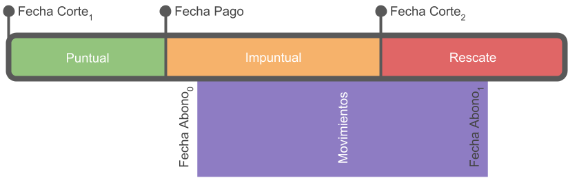

<!-- # Literature -->

<!-- Here is a review of existing methods. -->

# El Modelo

 


de todos los 

por complicaciones que no deben razones que no tienen que ver con Para todos los cortes históricos y. 

<fechaAbonos son NAs>

* **Ejemplo 1**

El cliente X sabe que debe pagar 1,000 pesos en el corte 1. Los clientes pueden cubrir su monto a pagar en varios abonos, así que el cliente X hizo dos abonos: 250 pesos antes de la fecha de pago, y 750 pesos después de la fecha de pago pero antes de la fecha de corte 2. En la figura \<ref\> vemos representados estos movimientos.

```{r, ej1, echo=FALSE, out.width="70%", fig.align="center", fig.cap="Pago impuntual"}
knitr::include_graphics("./images/ej_1.png")
```

label_dias_despues_fechaPago_prom = 
get_label_prom(dias_despues_fechaPago, ventana_predict = params$ventana_predict)

label_impuntual_2 = (label_dias_despues_fechaPago_prom >= 2) * 1

get_label_prom <- function(
  x, 
  ventana_predict
) {
  lag.xts(rollmean(x, 
                   k = ventana_predict, 
                   na.pad = TRUE, 
                   align = 'left'), 
          k = -1)
}


En el ejemplo de la figura \<ref\> el cliente hizo algunos movimientos antes de la fecha de pago pero terminó de cubrir el monto a pagar después de esa fecha. En este caso la fecha de abono se encuentra entre la fecha de pago y la fecha de corte del siguiente periodo.

* **Ejemplo 3**



En este último ejemplo tenemos que los abonos del periodo son impuntuales y de rescate, y la fecha de abono ocurre después de la fecha de corte del siguiente periodo.

Nos hemos familiarizado con los términos fecha de corte, fecha de pago, fecha de abono; también ahora entendemos qué significa que un abono o movimiento sea puntual, impuntual o de rescate. Finalmente, de forma similar, clasificaremos pagos de corte en función de la fecha de abono:

* **Pago puntual** si la fecha de abono se encuentra antes de la fecha de pago
* **Pago impuntual** si la fecha de abono se encuentra después de la fecha de pago y antes de la fecha de corte del siguiente periodo
* **Pago en rescate** si no se cubrió el monto a pagar antes de la fecha de corte del siguiente período. Cuando un cliente deja de pagar definitavamente, el cliente está *en rescate* o cayó en *default*.

< falta incluir definición de alto riesgo >

Este será el lingo que usaremos de aquí en adelante.


; autorizar el proyecto de desarrollo del modelo requería identificar mecanismos de validación. 

E

A continuación presentaremos las métricas de desempeño del modelo base y del modelo nulo que el indicador de impuntualidad debía superar.


debía superar para que pudiera incorporarse a los procesos del Banco.

A continuación explicamos como se construyó la variable de salida.

Es indispensable contar con labeled data para usar un modelos supervisado. ,   labels

## Modelo Base y Modelo Nulo

## EDA y Feature Engineering 

