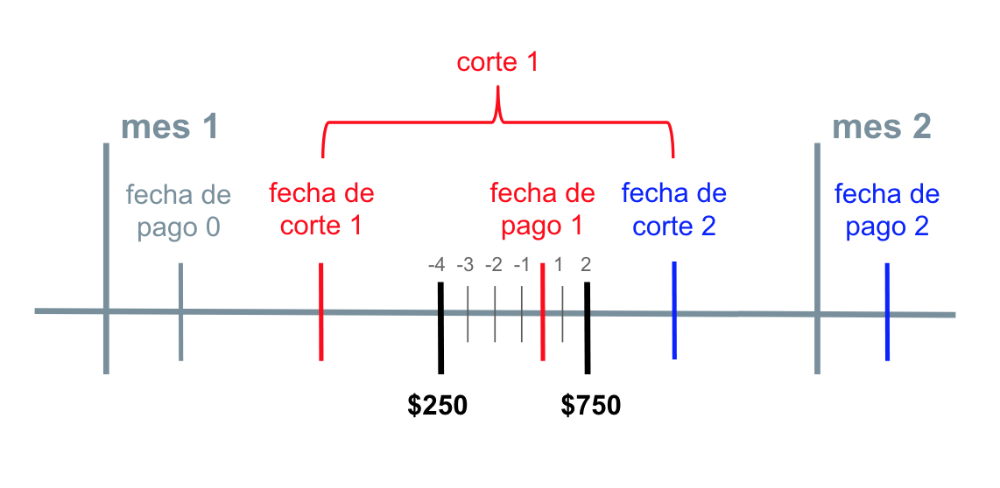

<!-- # Literature -->

<!-- Here is a review of existing methods. -->

# Proyecto

## Historias de Crédito

Para poder analizar un portafolio de crédito, debemos entender que un crédito cuenta una historia. Podemos pensar en una historia de crédito como un conjunto de series de tiempo -saldos, pagos- que corresponden a un acreditado. En la figura \@ref(fig:saldos) tenemos el saldo de un crédito en el tiempo. Veamos qué nos puede decir la serie de tiempo del saldo sobre este crédito. 

<!-- ```{r} -->
<!-- ejemplos <- creditos %>%  -->
<!--   filter(indice_ultimo_saldo >= 40,  -->
<!--          indice_ultimo_saldo <= 50,  -->
<!--          max_fechaCorteDespues <= as.Date("2018-05-01")) %>%  -->
<!--   group_by(pkcolocadora) %>%  -->
<!--   summarise(min_saldo = min(saldo_prom_decay),  -->
<!--             max_saldo = max(saldo_prom_decay),  -->
<!--             diff_saldo = max_saldo - min_saldo,  -->
<!--             label = max(label_impuntual_2)) %>%  -->
<!--   ungroup() %>%  -->
<!--   filter(diff_saldo >= 50000,  -->
<!--          label == 0) %>%  -->
<!--   pull(pkcolocadora) -->

<!-- for(colocadora_ej in ejemplos){ -->
<!--   p <- creditos %>% -->
<!--     filter(pkcolocadora == colocadora_ej) %>% -->
<!--     select(fechaCorte,  -->
<!--          saldoActual,  -->
<!--          saldo_prom_decay,  -->
<!--          minimoPagar,  -->
<!--          puntual) %>%  -->
<!--     rename(date = fechaCorte) %>%  -->
<!--    gather(key, value,-date) %>% -->
<!--    ggplot(aes(x = date,  -->
<!--              y = value, -->
<!--              colour = key)) +  -->
<!--     geom_line() +  -->
<!--     labs(title = colocadora_ej) -->
<!--   print(p) -->
<!-- } -->
<!-- ``` -->


```{r, saldos, echo=FALSE, out.width="80%", fig.pos="H", fig.align="center", fig.cap="Saldo y mínimo a pagar de un cliente"}
colocadora_ej <- 21160

design_matrix %>%
  filter(pkcolocadora == colocadora_ej) %>%
  select(fechaPago, 
         saldoActual,
         minimoPagar) %>% 
  rename(date = fechaPago) %>% 
  gather(key, value,-date) %>%
  ggplot(aes(x = date, 
             y = value,
             colour = key)) +
    geom_line()
```

Por un lado, tenemos que la *fecha de inicio* del crédito fue en enero 2015 y, durante ese año, el cliente fue aumentando su saldo de \$1,000 a \$100,000 pesos. Por otro lado, podemos ver que durante 2016 el cliente fue saldando su crédito hasta liquidarlo por completo en enero de 2017. 

En la misma figura se muestra el pago mínimo que el acreditado debía cubrir en cada corte. Cuando un cliente conoce el saldo y el monto a pagar de su crédito en una fecha de corte, este tiene que realizar sus pagos. Veamos distintos comportamientos de pago con ejemplos. 

**Ejemplo 1**
Supongamos que el cliente $X$ debe pagar 1,000 pesos en el corte 1. Ya que los clientes pueden cubrir su monto a pagar en varios abonos, el cliente X hizo dos abonos:

* 250 pesos cuatro días antes de la fecha de pago 1, y 
* 750 pesos dos días después de la fecha de pago 1. 

En la figura \@ref(fig:ej1) vemos representados estos movimientos. En este caso el 25% del pago fue puntual y el 75% impuntual. Además, de acuerdo con la definición de momento de pago de la sección \@ref(propuesta), tenemos que el momento de pago del cliente $X$ en el corte 1 es de dos días.

```{r, ej1, echo=FALSE, out.width="80%", fig.align="center", fig.pos="H",  fig.cap="Comportamiento de pago del cliente X"}

```

**Ejemplo 2**
El cliente $Y$ debía pagar 1,000 pesos en el corte 1, y 1500 pesos en el corte 2. En la figura \@ref(fig:ej2) tenemos los abonos del cliente $Y$. Podemos ver que:

* El cliente cubrió su monto a pagar del corte 1 con un abono de 1,000 pesos siete días después de la fecha de pago 1. Así, el 100% de su pago fue impuntual y el momento de este pago es 7.
* El cliente cubrió su monto a pagar del corte 2 con un abono de 750 pesos tres días después de la fecha de pago 2, y con otro abono de 750 pesos ocho días después de la fecha de pago 2. Así, el 50% del pago fue impuntual y el otro 50% fue de rescate. El momento de pago del cliente $Y$ en el corte 2 es de 8 días.

```{r, ej2, echo=FALSE, out.width="80%", fig.align="center", fig.pos="H", fig.cap="Comportamiento de pago del cliente Y"}

```

A continuación veamos en gráficas de series de tiempo la puntualidad de pago de un cliente real.

En la figura \@ref(fig:pagos) en el recuadro superior vemos el mínimo a pagar y los abonos puntuales, impuntuales o de rescate que hizo un cliente a lo largo del tiempo. En el recuadro inferior tenemos la representación de la puntualidad de estos pagos en valores porcentuales.


<!-- ```{r} -->
<!-- ejemplos <- creditos %>% -->
<!--   filter(indice_ultimo_saldo >= 40, -->
<!--          indice_ultimo_saldo <= 50) %>% -->
<!--   group_by(pkcolocadora) %>% -->
<!--   summarise(min_saldo = min(saldo_prom_decay), -->
<!--             max_saldo = max(saldo_prom_decay), -->
<!--             diff_saldo = max_saldo - min_saldo) %>% -->
<!--   ungroup() %>% -->
<!--   filter(diff_saldo >= 50000) %>% -->
<!--   pull(pkcolocadora) -->

<!-- for(colocadora_ej in ejemplos[600:620]){ -->
<!--   p <- creditos %>% -->
<!--     filter(pkcolocadora == colocadora_ej) %>% -->
<!--     select(fechaCorte, -->
<!--          minimoPagar, -->
<!--          puntual,  -->
<!--          impuntual,  -->
<!--          rescate) %>% -->
<!--     rename(date = fechaCorte) %>% -->
<!--    gather(key, value,-date) %>% -->
<!--    ggplot(aes(x = date, -->
<!--              y = value, -->
<!--              colour = key)) + -->
<!--     geom_line() + -->
<!--     labs(title = colocadora_ej) -->
<!--   print(p) -->
<!-- } -->

<!-- ``` -->


```{r, pagos, echo=FALSE, fig.align="center", fig.pos="H", fig.cap="Puntualidad de pago de un cliente"}
colocadora_ej = 37082
  
plot1 <- creditos %>% 
  filter(pkcolocadora == colocadora_ej) %>%
  select(fechaCorte,
         minimoPagar,
         puntual, 
         impuntual, 
         rescate) %>% 
  rename(date = fechaCorte) %>% 
  gather(key, value,-date) %>% 
  ggplot(aes(x = date,
             y = value,
             colour = key)) + 
  geom_line()

plot2 <- creditos %>% 
  filter(pkcolocadora == colocadora_ej) %>%
  select(fechaCorte,
         porc_puntual,
         porc_impuntual, 
         porc_rescate) %>% 
  rename(date = fechaCorte) %>% 
  gather(key, value,-date) %>% 
  ggplot(aes(x = date,
             y = value,
             colour = key)) + 
  geom_line()

grid.arrange(plot1, plot2, nrow=2)
```

A primera vista podemos apreciar que el porcentaje pagado no siempre suma 100%; por ahora ignoraremos esto ya que en la Sección \@ref(limpieza) se cubre la limpieza de datos. Poniendo atención al comportamiento de pago representado en la imagen tenemos que:

* El cliente hizo pagos puntuales en la primer mitad del año 2017. 
* A partir de julio 2017 el cliente empieza a hacer pagos impuntuales más frecuentemente. 
* En 2018 el cliente se atrasa frecuentemente en sus pagos y en varios cortes realiza pagos de rescate.

<!-- En la figura \<ref\> se muestran los momentos de pago del mismo cliente. De esta forma: -->

<!-- * en los primeros dos cortes el momento de pago es negativo pues el cliente cubrió su mínimo a pagar unos días antes de la fecha de pago,  -->
<!-- * el momento de pago es cero cuando el cliente cubrió su mínimo a pagar justo en la fecha de pago, y  -->
<!-- * cuando el cliente hace pagos de rescate, el momento de pago alcanza valores mayores a 10 . -->

<!-- ```{r, momento, echo=FALSE, out.width="70%", fig.align="center", fig.cap="Momento de Pago de un Cliente"} -->
<!-- creditos %>%  -->
<!--   filter(pkcolocadora == colocadora_ej) %>% -->
<!--   select(fechaCorte, -->
<!--          dias_despues_fechaPago) %>%  -->
<!--   rename(date = fechaCorte) %>%  -->
<!--   gather(key, value,-date) %>%  -->
<!--   ggplot(aes(x = date, -->
<!--              y = value, -->
<!--              colour = key)) +  -->
<!--   geom_line() -->
<!-- ``` -->

## Limpieza de datos{#limpieza}

Probablemente el lector ya se ha preguntado si el Banco registra los datos en el formato necesario para visualizar las historias de crédito de sus clientes como en las figuras \@ref(fig:saldos) y \@ref(fig:pagos). La respuesta es que se tuvieron que adecuar y limpiar extensivamente los datos transaccionales del Banco.

El Banco almacena la mayor parte de su información en una base de datos relacional. Esta base contiene casi 1,109 tablas. Los encargados de la base recomendaron a los científicos de datos qué tablas explorar para poder construir las historias de crédito de sus clientes. Los científicos de datos utilizaron principalmente dos tablas: 

* **tabla de saldos** - tabla en la que se registran saldos y mínimo a pagar de los clientes en cada corte, y
* **tabla de transacciones de pago** - tabla en la que se registran todos los movimientos de pago de los clientes.

Uno de los retos principales para los científicos de datos en este proyecto fue limpiar y unir las tablas para obtener historias de crédito congruentes. A continuación se describen algunas de las decisiones que se tomaron en la limpieza de datos. 

**Fechas de inicio de las tablas que contienen datos históricos**

Ya que el esquema de las bases de datos del Banco ha cambiado conforme el negocio crece, se tiene que la fecha de inicio de las tablas no es la misma. La fecha de inicio de la tabla de saldos es noviembre 2008 y la fecha de inicio de la tabla de transacciones de pago es febrero 2013. Con esto, la fecha de inicio de la *tabla de historias de crédito* que construyó el equipo de científicos de datos es febrero 2013.

**Períodos activos de los clientes**

Ya que las tablas de saldos y de transacciones de pago no tienen registros antes de febrero 2013, para identificar fechas de activación de clientes previas a esta fecha se recurrió a otra tabla legacy. La fecha de activación de los clientes era necesaria para calcular adecuadamente la antigüedad de los clientes.

**Secuencia de estampas de tiempo**

En algunos casos, la secuencia en una historia de crédito tenía datos faltantes. En lugar de imputar pagos, se decidió eliminar la estampa de tiempo en la historia del cliente cuando sólo faltaba una estampa de forma consecutiva. Cuando se tenían datos faltantes en dos o más estampas consecutivas se decidió asignarle una bandera al cliente y avisarle al Banco que no se podría generar una predicción para ese cliente.

La figura \@ref(fig:faltantes) muestra el histograma del número de estampas consecutivas faltantes en las historias de los clientes excluyendo el cero.

```{r, faltantes, echo=FALSE, out.width="50%", fig.align="center", fig.pos="H", fig.cap="Histogramas de número de fechas faltantes consecutivas"}
# limpieza %>% 
#   filter(max_fechas_faltantes_seguidas > 0) %>% 
#   ggplot(aes(x=max_fechas_faltantes_seguidas)) +
#   geom_histogram()

limpieza %>% 
  filter(max_fechas_faltantes_seguidas > 0) %>% 
  pull(max_fechas_faltantes_seguidas) %>% 
  hist()
```


Existen clientes que dejaron de tener actividad crediticia por periodos de más de un año. En estos casos se decidió ignorar el pasado de los cliente y considerarlos como nuevos clientes a partir de la fecha en la que volvieron a estar activos. Además, se consideraron como inactivos a los clientes que mantenía un saldo negativo o un saldo menor de 1,000 pesos en varios periodos consecutivos. 

**Clasificación de abonos**

La tabla de movimientos contiene registros de transacciones pero no contiene una columna en la que se clasifiquen los abonos en puntuales, impuntuales o de rescate. El primer procedimiento que se desarrolló para clasificar los abonos de cada cliente en cada corte tardaba 24 horas. Después de optimizar el uso de memoria, este procedimiento se mejoró y la última versión tarda a lo más diez minutos. 

**Liquidaciones**

En muchas ocasiones el mínimo abonado y el mínimo a pagar de los clientes no coinciden al centavo. Esto simplemente significa que los clientes normalmente redondean el monto a pagar por comodidad. Por otro lado, un cliente puede querer liquidar antes su deuda haciendo pagos que exceden el mínimo a pagar. En estos casos se decidió acotar el valor máximo del porcentaje puntual, impuntual y de rescate a 1.5.  

## Feature Engineering

Las series de tiempo de personas con buen historial crediticio comparten ciertos patrones, lo mismo ocurre con personas impuntuales. Debemos diseñar variables que nos permitan identificar mejor dichos patrones. Hasta este momento, entendemos el comportamiento o características de cada crédito en una fecha de corte específico. Sin embargo, esta información no nos aporta información del comportamiento de pago en el pasado.

Se construyeron tres tipos de variables que, a partir de las series de tiempo que conforman una historia de crédito, resumen el comportamiento pasado de un cliente. El primer tipo de variable es un promedio ponderado que utiliza una función de decaimiento que permite asignar más peso a la historia reciente del cliente. Los otros dos tipos de variables capturan la magnitud de los cambios y la desviación estándar en las historias de crédito de los clientes. A continuación se describen a más detalle estas tres variedades.

### Decaimiento Geométrico y Promedios Móviles

Existen muchos métodos para obtener series de pesos con **decaimiento** que sumen uno. Con algunos métodos se obtienen pesos que decaen demasiado rápido, como el decaimiento exponencial. El **half-life** es un concepto que ayuda a controlar que tan rápido deben decaer el tamaño de los pesos.

Un **half-life se alcanza cuando se acumula la mitad de la suma de los pesos**. En nuestro contexto el decaimiento ocurre de lo más reciente a lo más lejano. Por ejemplo, un half-life de 3 meses implica que:

-   los pesos asignados en los tres meses más recientes acumulan
    aproximadamente 0.5, y
-   los pesos para el resto de la serie acumulan aproximadamente 0.5.

De esta manera, series de pesos con un half-life de tres meses decaen más rápido que series de pesos con un half-life de un año.

En el Anexo \@ref(decaimiento) se incluye el detalle teórico de la construcción de pesos con *decaimiento geométrico* para lo que se utilizan, precisamente, distribuciones geométricas. A partir de series de decaimiento geométrico generados con ese método y series de saldo de los clientes generamos las variables:

* `saldo_prom_decay` series de saldo con decaimiento y half-life de tres meses.
* `saldo_prom_decay3` series de saldo con decaimiento y half-life de tres cortes.

Es importante recalcar que no solo se calcularon pesos de decaimiento individualmente para cada cliente. Dado un cliente, se generaron series en cada corte cómo si se estuviera colapsando el pasado en cada paso de su recorrido de crédito. De esta manera las series que generamos son promedios móviles. Finalmente aclaramos que se determinó que para producir una predicción para un cliente, este necesitaba al menos contar con una historia de 6 periodos.

La figura \@ref(fig:decaimiento) muestra un ejemplo de las serie de saldos móviles resultantes. Como se observa, el decaimiento incorpora la información del pasado en cada momento y además suaviza o elimina el ruido de la serie original. Además, podemos ver que el half-life de tres meses suaviza mucho más la serie que el half-life de tres cortes.

<!-- ```{r} -->
<!-- ejemplos <- creditos %>% -->
<!--   filter(indice_ultimo_saldo >= 50) %>% -->
<!--   group_by(pkcolocadora) %>% -->
<!--   summarise(min_saldo = min(saldo_prom_decay), -->
<!--             max_saldo = max(saldo_prom_decay), -->
<!--             diff_saldo = max_saldo - min_saldo) %>% -->
<!--   ungroup() %>% -->
<!--   filter(diff_saldo >= 50000) %>% -->
<!--   pull(pkcolocadora) -->

<!-- for(colocadora_ej in ejemplos[5000:5020]){ -->
<!--   p <- creditos %>% -->
<!--     filter(pkcolocadora == colocadora_ej) %>% -->
<!--     select(fechaCorte, -->
<!--          saldoActual,  -->
<!--          saldo_prom_decay) %>% -->
<!--     rename(date = fechaCorte) %>% -->
<!--    gather(key, value,-date) %>% -->
<!--    ggplot(aes(x = date, -->
<!--              y = value, -->
<!--              colour = key)) + -->
<!--     geom_line() + -->
<!--     labs(title = colocadora_ej) -->
<!--   print(p) -->
<!-- } -->

<!-- ``` -->

```{r, decaimiento, echo=FALSE, fig.align="center", fig.pos="H", fig.cap="Decaimiento con half-life de tres meses y tres cortes", out.width="70%"}

colocadora_ej = 15691

creditos %>% 
  filter(pkcolocadora == colocadora_ej) %>%
  select(fechaCorte,
         saldoActual, 
         saldo_prom_decay, 
         saldo_prom_decay3) %>% 
  rename(date = fechaCorte) %>% 
  gather(key, value,-date) %>% 
  ggplot(aes(x = date,
             y = value,
             colour = key)) + 
  geom_line()
```

<!-- Por otro lado, transformamos con decaimiento geométrico las series de porcentaje puntual, impuntual y rescate de los clientes con lo que generamos otras tres variables: `porc_puntual_decay`, `porc_impuntual_decay`, y `porc_rescate_decay`.  -->


### Series de Diferencias y Desviación Estándar

Al restar en cada estampa de tiempo el saldo de un cliente menos el saldo de la estampa de tiempo anterior, se obtuvieron series de diferencias en saldo que guardamos en la variable `diff_saldo`. 

En cada estampa de tiempo se calculó la desviación estándar con decaimiento del saldo de un cliente. Las series de desviaciones las asignamos a la variable `saldo_sd_decay3`.

En la figura \@ref(fig:volatilidad) tenemos las series de diferencias y de desviación estándar del saldo de un crédito. 

<!-- ```{r} -->
<!-- ejemplos <- creditos %>% -->
<!--   filter(indice_ultimo_saldo >= 50) %>% -->
<!--   group_by(pkcolocadora) %>% -->
<!--   summarise(min_saldo = min(saldo_prom_decay), -->
<!--             max_saldo = max(saldo_prom_decay), -->
<!--             diff_saldo = max_saldo - min_saldo) %>% -->
<!--   ungroup() %>% -->
<!--   filter(diff_saldo >= 50000) %>% -->
<!--   pull(pkcolocadora) -->

<!-- for(colocadora_ej in ejemplos[5000:5020]){ -->
<!--   p <- creditos %>% -->
<!--     filter(pkcolocadora == colocadora_ej) %>% -->
<!--     select(fechaCorte, -->
<!--          saldoActual, -->
<!--          saldo_prom_decay, -->
<!--          delta_saldo_prom_decay, -->
<!--          delta_saldo_sd_decay) %>% -->
<!--     rename(date = fechaCorte) %>% -->
<!--    gather(key, value,-date) %>% -->
<!--    ggplot(aes(x = date, -->
<!--              y = value, -->
<!--              colour = key)) + -->
<!--     geom_line() + -->
<!--     labs(title = colocadora_ej) -->
<!--   print(p) -->
<!-- } -->
<!-- ``` -->

```{r, volatilidad, fig.pos="H", fig.cap="Series de diferencias y desviaciones estandar de un cliente", echo=FALSE, out.width="70%", fig.align="center"}
colocadora_ej = 15695

creditos %>% 
  filter(pkcolocadora == colocadora_ej) %>%
  select(fechaCorte,
         saldoActual,
         saldo_prom_decay3,
         diff_saldo,
         diff_saldo_sd_decay3) %>% 
  rename(date = fechaCorte) %>% 
  gather(key, value,-date) %>% 
  ggplot(aes(x = date,
             y = value,
             colour = key)) + 
  geom_line()
```

La siguiente lista muestra algunos ejemplos de las variables que se utilizaron en la selección de modelos:

* `antiguedad` - antigüedad de los cliente en cada corte. 
* `saldoActual` - saldo de los cliente en cada corte.
* `dias_despues_fechaPago` - momento de pago de los cliente en cada corte.
* `dias_despues_fechaPago_prom_decay3` - promedios móviles del momento de pago histórico, ponderado con decaimiento geométrico y half-life de tres cortes.
* `porc_puntual` - porcentaje puntual del pago de los clientes en cada corte.
* `porc_puntual_prom_decay` - promedios móviles (con decaimiento geométrico y half-life de tres meses) del porcentaje puntual de los pagos. 
* `porc_puntual_sd_decay` - desviaciones estándar del porcentaje puntual de los pagos, ponderados con decaimiento geométrico y half-life de tres meses.

En el Anexo \@ref(features) se incluye una lista más amplia de variables.

### Etiquetas 

Recordemos que en la Sección \@ref(propuesta) se dijo que el indicador de impuntualidad debe predecir si, en los siguientes tres cortes, el momento de pago de un cliente cae en la cola amarilla y roja del tríangulo de pagos. 

De acuerdo con lo que los representantes del Banco les explicaron a los científicos de datos, es común que los clientes se atrasen uno o dos días en sus pagos por algún contratiempo sin representar un riesgo. Por esto, conjuntamente se decidió que la etiqueta de un cliente en $t$ debía considerar el promedio de los momentos de pago de los siguientes tres cortes $t+1$, $t+2$ y $t+3$; y que la etiqueta sería 1 si el promedio es mayor a 2 y 0 en los demás casos.

<!-- Usando el comportamiento de pago del cliente $Y$ en el Ejemplo 2, si estamos parados en la fecha de pago 0 tenemos que: -->

<!-- * El momento de pago en el corte 1 es xxx, en el corte 2 es xxx y en el corte 3 es xxxx.  -->
<!-- * El promedio de los momentos de pago de los siguientes tres cortes es xxx. -->
<!-- * La etiqueta de impuntualidad correspondiente al cliente $y$ en la fecha de pago 0 tiene un valor de 1.  -->

Se calcularon los promedios de los momentos de pago en los tres cortes siguientes en cada corte y las etiquetas de impuntualidad las guardamos en la variable `label_impuntual_2`.

## Selección de Modelos

Lo primero que trataremos en esta sección es el cross-validation que se utilizó para la selección de modelos. En este caso, los datos son series de tiempo y hay una dependencia de lo que ocurre en el pasado con lo observado después. Como es indispensable hacer un three-way holdout en el que no haya fuga de información, las particiones se hicieron de la siguiente manera:

* Conjunto de entrenamiento - todos los datos antes de `2017-06-30` que acumulan el 68% del total.
* Conjunto de validación - los datos entre `2017-07-01` y `2017-12-31` acumulando el 16% del total.
* Conjunto de prueba - los datos después de `2018-01-01` que acumulan el 16% del total.

Como se mencionó en la Sección \@ref(validacion) la proporción de positivos y negativos en las etiquetas históricas es de 90.3% y 9.7%. Las proporciones en los tres conjuntos de cross-validation se mantuvieron muy cerca de estos valores.

Es claro que estamos tratando con el entrenamiento de un modelo supervisado de clasificación y que es posible probar diferentes modelos como regresión logística, bosques aleatorios o gradient boosting classifiers. Los científicos de datos probaron distintas combinaciones de modelos, hiperparámetros y de variables. El modelo que resultó tener mayor valor predictivo para el Banco fue el Gradient Boosting Classifier. Más sobre la elección de este algoritmo se cubre adelante.

Hagamos un ejercicio visual simple que nos permita ver cómo el decaimiento ayuda a capturar el patrones de pago de los clientes. La figura \@ref(fig:pca) contiene dos gráficas de componentes principales. La diferencia en las gráficas es que los puntos se generaron con distintas matrices de rotación:

* En el recuadro de la derecha se construyó la matriz de rotación con cuatro variables que solo consideran el último corte observado: `antiguedad`, `saldoActual`, `diff_saldo`, `dias_despues_fechaPago`, y `porc_puntual`. 
* En el recuadro de la izquierda se construyó la matriz de rotación con variables que incorporan información del pasado con decaimiento: `antiguedad`, `saldo_prom_decay3`, `dias_despues_fechaPago_prom_decay3`, `porc_puntual_prom_decay`, y `porc_puntual_sd_decay`. 

Los puntos en azul claro representan entradas con etiquetas de impuntualidad positivas, los puntos en azul obscuro tienen etiquetas negativas.

```{r, pca, fig.pos="H", fig.cap="Transformaciones de dos subconjuntos de variables", echo=FALSE, out.width="70%", fig.align="center"}
scaling <- function(x, na.rm = FALSE) (x - mean(x, na.rm = na.rm)) / sd(x, na.rm)
set.seed(2019)
train <- which(creditos$fechaCorte <= as.Date("2017-12-31"))
test <- which(creditos$fechaCorte > as.Date("2017-12-31"))
sampling <- sample(nrow(creditos[test, ]), 300)

cols <- c('antiguedad', 'saldo_prom_decay3', 'porc_puntual_prom_decay', 'porc_puntual_sd_decay')

df_train <- creditos[train, ] %>% 
  select(cols) %>% 
  mutate_all(scaling)

comps <- prcomp(df_train)
evec <- comps$rotation

df_test <- creditos[test, ] %>% 
  select(cols) %>% 
  mutate_all(scaling)

rot_df_test <- as.matrix(df_test) %*% evec
rot_df_test <- as.data.frame(rot_df_test)
rot_df_test$label_impuntual_2 <- creditos$label_impuntual_2[test]

p1 <- rot_df_test[sampling, ] %>%  
  ggplot(aes(x=PC1, y=PC2, colour=label_impuntual_2)) + 
  geom_point(alpha=0.75) + theme(legend.position = "none")

cols <- c('antiguedad', 'saldoActual', 'diff_saldo','porc_puntual')

df_train <- creditos[train, ] %>% 
  select(cols) %>% 
  mutate_all(scaling)

comps <- prcomp(df_train)
evec <- comps$rotation

df_test <- creditos[test, ] %>% 
  select(cols) %>% 
  mutate_all(scaling)

rot_df_test <- as.matrix(df_test) %*% evec
rot_df_test <- as.data.frame(rot_df_test)
rot_df_test$label_impuntual_2 <- creditos$label_impuntual_2[test]

p2 <- rot_df_test[sampling, ] %>% 
  ggplot(aes(x=PC1, y=PC2, colour=label_impuntual_2)) + 
  geom_point(alpha=0.75) + theme(legend.position = "none")

grid.arrange(p1, p2, ncol=2)
```

Los puntos claros se separan más de los puntos obscuros en el recuadro izquierdo que en el recuadro derecho. Esto nos da señales de que el decaimiento capturan información sobre el pago futuro de los clientes que no nos proporcionan los datos puntuales de los créditos.

Por otro lado, veamos los resultados de tres bosques aleatorios. El primero `short` se ajustó sobre un grupo de variables de datos puntuales, el segundo `mid` sobre un grupo de variables de datos con decaimiento y el tercero `long` con variables tanto puntuales como con decaimiento. En la figura \@ref(fig:precision-recall) tenemos sus curvas de precision-recall.

```{r, precision-recall, echo=FALSE, out.width="80%", fig.align="center", fig.pos="H", fig.cap="Curvas de precision-recall"}
knitr::include_graphics("./images/precision-recall.png")
```

Finalmente, veamos la curva roc de tres algoritmos de clasificación en la figura \@ref(fig:roc): regresión logística con penalización L2, bosque aleatorio y gradient boosting classifier. Los tres algoritmos fueron entrenados sobre el conjunto de datos `long` con variables de datos puntuales y con decaimiento.

```{r, roc, echo=FALSE, out.width="80%", fig.align="center", fig.pos="H", fig.cap="Curvas roc de tres algoritmos"}

```

Con esto, ejemplificamos el proceso de selección de modelos que realizaron los científicos de datos. El Gradient Boosting Classifier es el que alcanza el mejor desempeño.

<!-- Ahora incorporemos la etiqueta `label_dias_despues_fechaPago_prom` y otras variables al cálculo de componentes principales para obtener la gráfica de *loadings* que apreciamos en la figura \<ref\>. A partir de esta gráfica podemos decir que las dos direcciones de mayor varianza en nuestros datos se pueden interpretar como En esta gráfica vemos que la primer componente principal está más influenciada por   -->

<!-- Podríamos presentar y comparar los diferentes poderes predictivos que obtuvieron los científicos de datos con los diferentes modelos, en su lugar, daremos buenas razones de porqué elegir el gdb que supera a los demás modelos. -->

<!-- Aunque las variables que se diseñaron describen diferentes partes de una historia de crédito, estás variables están muy correlacionadas. En la figura <\ref\> tenemos el heat-map de la correlación de algunas de las variables. -->

## Desempeño del Modelo{#desempeno}

En la Sección \@ref(validacion) sobre métricas de validación, establecimos que para aprobar un modelo, este debía alcanzar un recall de 50% y una especificidad de 93%. A continuación mostramos las métricas de desempeño del modelo puesto en producción.

Ya mencionamos que el modelo elegido fue un Gradient Boosting Classifier. Este tipo de algoritmos no requieren que se haga una selección de variables muy extensiva \<bib\>, y se entrenó con el conjunto de variables que presentamos en el Anexo \@ref(features). La selección de hiperparámetros consistió basicamente en elegir la profundidad de los árboles con un grid. El número de árboles quedó determinado por el early stopping que está incorporado al algoritmo utilizado.

A continuación mostramos las medidas desempeño del modelo que se obtienen con el corte (threshold) elegido. Por corte nos referimos al valor a partir del cual se le asigna a una predicción el valor de uno o cero.  

* Matriz de confusión

|                |          | **actual**                 |
|----------------|----------|--------------|-------------|
|                |          |   positivo   |  negativo   |
| **predicción** | positivo |      5%      |     2.7%    |
|                | negativo |      5%      |    87.3%    |

* recall 50% - Este nivel de recall cumple con las expectativas establecidas por las métricas de validación. 
* precision 66.3% - Ya que el objetivo del modelo de predicción es accionar estrategias de cobranza correctivas es importante tomar en cuenta cuántos recursos se destinan a este esfuerzo. En ese sentido es importante considerar la precisión del modelo elegido para evitar gastos innecesarios.
* accuracy 92.3% - Este nivel de accuracy excede lo requerido satisfactoriamente.

Después de que el Banco aprobó el desempeño del modelo entrenado, se refactorizó el código y se puso en producción en un pipeline De esta manera se empezaron a producir indicadores de impuntualidad para los clientes activos. 

Además, se empezó a generar el monto en riesgo que equivale al indicador de impuntualidad de los clientes multiplicados por su saldo. Con esto se facilitó priorizar los esfuerzos de cobranza correctiva y enfocar recursos en aquellos clientes con mayor monto en riesgo. 

Finalmente, presentamos las variables que tienen mayor poder predictivo para el Gradient Boosting Clasifier en el orden de su importancia. La segunda y tercer columnas contienen el valor de las medianas de estas variables en el grupo con etiqueta positiva y en el grupo con etiqueta negativa.

|Variables con mayor importancia     |etiqueta positiva|etiqueta negativa|
|------------------------------------|-----------------|-----------------|
|`dias_despues_fechaPago_prom_decay3`|1.23             |-0.7             |
|`dias_mora_prop_decay3`             |0.44             |0                |
|`dias_despues_fechaPago`            |1                |0                |
|`porc_puntual`                      |0.56             |1.04             |
|`saldoActual`                       |54,848           |54,290           |
|`antiguedad`                        |397              |548              |
|`porc_mora_prom_decay3`             |0.35             |0                |

Con esto podemos decir que `dias_despues_fechaPago_prom_decay3` el promedio con decaimiento de los momentos de pago es la variable que explica más la impuntualidad futura de pago de los clientes.

# Conclusiones

En las conclusiones exploraremos algunas ideas finales sobre las pruebas que podrían realizarse una vez puesto el modelo en producción. También hablaremos sobre un resultado interesante de otro proyecto que extiende el alcance del trabajo que presentamos aquí.

Una vez que se ha puesto en producción un modelo y al empezarse a generar nuevas predicciones, un cuestionamiento válido consiste en entender si el modelo se desempeña como se esperaba. En la sección \@ref(desempeno) se presentaron métricas de desempeño puntuales; sin embargo, en otros datos las métricas serán distintas. ¿Cómo pueden compararse las métricas de desempeño sobre las nuevas predicciones con los valores puntuales que mostramos originalmente?

Quizá aquí vale la pena sugerir que cuando un modelo va a ponerse en producción tiene sentido obtener el valor esperado de las métricas de desempeño y rangos de posibles valores. Con esto, las contrapartes pueden facilmente validar si el modelo en producción se sigue desempeñando de la misma manera que originalmente se planteó.

¿Cómo producir rangos de valores válidos para las métricas de desempeño? Hacer distribuciones de referencia con bootstrapping es una opción, aunque el problema que se enfrenta aquí es que el conjunto de prueba es finito y su tamaño afecta de forma directa el tamaño del conjunto de entrenamiento; además recordemos que estamos tratando con series de tiempo y el supuesto de independencia no se cumple. Por esto vamos a recurrir a distribuciones paramétricas.

Dividimos el conjunto de prueba en diez subconjuntos, validamos que el tamaño de los subconjuntos sea aceptable y obtenemos la precisión en cada uno. Con esto obtenemos diez valores distintos de precisión, como son pocas observaciones, ajustamos una t-student a la transformación logit de los datos. Finalmente, calculamos el percentil 5% y 95% para acumular el 90% de la distribución.Así, el rango de posibles valores de precisión de nuestro modelo se encuentra entre 61% y 72%. 

Si hacemos lo mismo con el recall, el intervalo resultante va del 37% al 59%. Como vemos, la métrica de recall tiene más varianza que la de precisión y esto es información muy valiosa. En la figura \@ref(fig:t-student) incluimos la distribución empírica y la teórica que se ajustó.

```{r, t-student, echo=FALSE, out.width="50%", fig.align="center", fig.pos="H", fig.cap="Curvas roc de tres algoritmos"}
knitr::include_graphics("./images/t_student.png")
```

No hay que perder de vista que estos rangos de valores no son los intervalos de confianza de las medias de dichas distribuciones y que los intervalos de confianza nos permiten conocer el valor esperado de las métricas de desempeño de todas las predicciones futuras agregadas. Al contruir un intervalo de confianza para la media de la precisión tenemos que este se encuentra entre 65% y 68%; y para la media del recall entre 44% y 51%.

Por último, platicaremos un resultado interesante derivado de un proyecto relacionado en el que el Banco les pidió a los científicos de datos predecir qué clientes dejarían de pagar y caerían en mora definitiva. Como punto de referencia, recordemos que en este trabajo describimos cómo se obtuvieron series de diferencias y de desviaciones estándard y que al evaluar la importancia de esas variables, en realidad no tenían mucho poder predictivo. 

Al poner las manos a la obra, los científicos de datos usaron las mismas variables que ya presentamos para entrenar otro Gradient Boosting Classifier con las etiquetas de impago definitivo. Fue una sorpresa ver que el modelo alcanzara casi el mismo desempeño para los impagos que para los pagos impuntuales. Al ver más de cerca, la importancia de las variables era distinta y para ese problema, las variables que incorporan diferencias y desviaciones estándar, tenían más importancia. 
<!-- segunda iteración de este proyecto se predijo el impago definitivo. El modelo resultante le da más peso a la desviación estándar y las diferencias.  -->