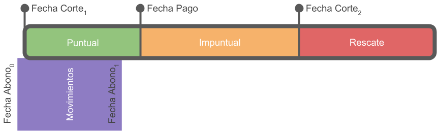

<!-- # Literature -->

<!-- Here is a review of existing methods. -->


```{r, include=FALSE}
library(feather)
library(tidyverse)

creditos <- read_feather('../pipeline/wrangle_train/output/collapse_train_20180823_prod.feather')
```

# El Modelo
## Modelo Base y Modelo Nulo
### Variable de Salida
## EDA y Feature Engineering 

```{r, include=FALSE}
library(feather)
library(tidyverse)
library(mltools)

creditos <- read_feather('../pipeline/wrangle_train/output/collapse_train_20180823_prod.feather')
```

```{r, include=FALSE}
median_saldo <- creditos %>% 
  mutate(date = mltools::date_factor(fechaPago, type = "yearquarter")) %>% 
  filter(date == "2018 Q1") %>% 
  pull(saldo_prom_decay) %>% median()
```
## Comportamiento de Pago

Ya conocemos a grandes rasgos qué componentes de los créditos nos interesan. En esta sección vemos la manera específica en la que el Negocio clasifica los pagos de sus clientes y el lingo que utiliza. 

Cada inicio de quincena (que llamaremos **fecha de corte**) se conoce el monto a pagar de cada cliente. Esa cantidad debe ser abonada antes de la fecha límite de pago (**fecha de pago**) que es ocho días después de la fecha de corte. Los clientes pueden cubrir el monto abonar en una sola exhibición o realizar varios abonos. Dependiendo del momento en que se hagan los movimientos, estos se clasifican como:

* **Abono puntual** si el movimiento ocurre antes de la fecha de pago
* **Abono impuntual** si el movimiento ocurre después de la fecha de pago pero antes de la siguiente fecha de corte
* **Abono de rescate** si el movimiento ocurre después de la siguiente fecha de corte

La fecha en la que los abonos o movimientos cubren el mínimo a pagar la llamaremos **fecha de abono**. Veamos algunos ejemplos de comportamiento de pago en función del momento en que ocurre la fecha de abono.

* **Ejemplo 1**



En el ejemplo de la figura \<ref\> el cliente realizó sus movimientos de forma puntual, es decir la fecha de abono es anterior a la fecha de pago.

* **Ejemplo 2**


En el ejemplo de la figura \<ref\> el cliente hizo algunos movimientos antes de la fecha de pago pero terminó de cubrir el monto a pagar después de esa fecha. En este caso la fecha de abono se encuentra entre la fecha de pago y la fecha de corte del siguiente periodo.

* **Ejemplo 3**


En este último ejemplo tenemos que los abonos del periodo son impuntuales y de rescate, y la fecha de abono ocurre después de la fecha de corte del siguiente periodo.

Nos hemos familiarizado con los términos fecha de corte, fecha de pago, fecha de abono; también ahora entendemos qué significa que un abono o movimiento sea puntual, impuntual o de rescate. Finalmente, de forma similar, clasificaremos pagos de corte en función de la fecha de abono:

* **Pago puntual** si la fecha de abono se encuentra antes de la fecha de pago
* **Pago impuntual** si la fecha de abono se encuentra después de la fecha de pago y antes de la fecha de corte del siguiente periodo
* **Pago en rescate** si no se cubrió el monto a pagar antes de la fecha de corte del siguiente período. Cuando un cliente deja de pagar definitavamente, el cliente está *en rescate* o cayó en *default*.

< falta incluir definición de alto riesgo >

Este será el lingo que usaremos de aquí en adelante.


# Introducción {#intro}

Un banco buscó a un grupo de científicos de datos con un problema en mente: pedirles ayuda para minimizar la impuntualidad de pago de sus clientes. 

La calidad de cartera del banco había disminuido en los últimos años. Se había seguido una estrategia reactiva en la que se destinaban muchos recursos al área de cobranza y se habían descuidado las herramientas preventivas. Era momento de cambiar el curso.

La intuición detrás del proyecto es que en al identificar las causas o síntomas de la morosidad, es posible acercarse a los clientes antes de que dejen de pagar y, por otro lado, limitarles la capacidad de aumentar su créditos. 

La capacidad de predecir la impuntualidad o el impago repercute directamente en la calidad de la cartera del banco. Esto es especialmente cierto cuando se tienen clientes que aumentan el valor de su crédito para ayudarse a cubrir su deuda anterior.

...

< dar más detalle de descripción de negocio y descripción de proyecto >

< mencionar que en este proyecto se trabaja con créditos revolventes >

...

## Historias de crédito

Podemos pensar en un crédito como un conjunto de series de tiempo -saldo, intereses, pagos- que corresponden a un acreditado. Las series de tiempo de personas con buen historial crediticio comparten ciertos patrones, lo mismo ocurre para personas que son impuntuales o para las que están próximas a dejar de pagar. 

Para familiarizarnos con esto, lo primero que haremos es entender cómo se "ven" los créditos con unos ejemplos. En la figura \<ref\> tenemos representado un acreditado que cumple puntualmente con sus pagos. Una línea representa el valor del saldo del crédito en el tiempo; la otra, la suma de los montos abonados puntualmente en cada fecha de pago.  

```{r, echo = FALSE}
colocadora_ej <- 31201

creditos %>%
  filter(pkcolocadora == colocadora_ej) %>%
  select(fechaCorte, saldoActual, puntual) %>% 
  rename(date = fechaCorte) %>% 
  gather(key, value,-date) %>%
  ggplot(aes(x = date, 
             y = value,
             colour = key)) +
    geom_line()
```

Como vemos el cliente mantiene un saldo aproximado de \$40,000 por un año, desde julio 2016 hasta julio 2017. En septiembre del 2017 incrementa el monto de su crédito a casi \$80,000, de ahí en adelante decide liquidar el crédito por lo que el saldo decrece poco a poco y se va acercando a cero. Este acreditado siempre hizo pagos puntuales.

El siguiente ejemplo representa un acreditado que realiza pagos impuntuales. La figura \<ref\> contiene una tercera línea que representa los montos abonados impuntualmente en cada periodo. 

```{r, echo = FALSE}
colocadora_ej <- 47399

creditos %>%
  filter(pkcolocadora == colocadora_ej) %>%
  select(fechaCorte, saldoActual, puntual, impuntual) %>% 
  rename(date = fechaCorte) %>% 
  gather(key, value,-date) %>%
  ggplot(aes(x = date, 
             y = value,
             colour = key)) +
    geom_line()
```

Este acreditado aumentó el monto de su crédito tanto en octubre como en abril y, a diferencia del caso anterior, no todos sus abonos son puntuales. Como vemos, en varias ocasiones el valor de los abonos impuntuales es mayor a cero.


Los créditos que el Banco otorga son revolventes y en el primer trimestre de 2018 tenían un saldo promedio de `{r} prettyNum(median_saldo, big.mark = ",", digits = 2)` MXN. La distribución del saldo se muestra en la figura \<ref\>. Como es usual para los saldos, tenemos una distribución con sesgo a la derecha.

```{r, echo=FALSE}
creditos %>% 
  mutate(date = mltools::date_factor(fechaPago, type = "yearquarter")) %>% 
  filter(date == "2018 Q1") %>% 
  ggplot(aes(saldo_prom_decay, stat(density))) + 
  geom_histogram(bins = 50)
```

¿Cuál es la diferencia entre “pago diferido”, “reestructura” y “convenio de salida”
Pago diferido y reestructura son herramientas de rescate que se le dan a distribuidoras que tienen la intención de seguir formando parte de ConCrédito. Es posible que sigan colocando.
Convenio se aplica únicamente a las colocadoras que ya no seguirán formando parte de ConCrédito

Veamos algunos ejemplos de comportamiento de pago en función del momento en que ocurre la fecha de abono.
